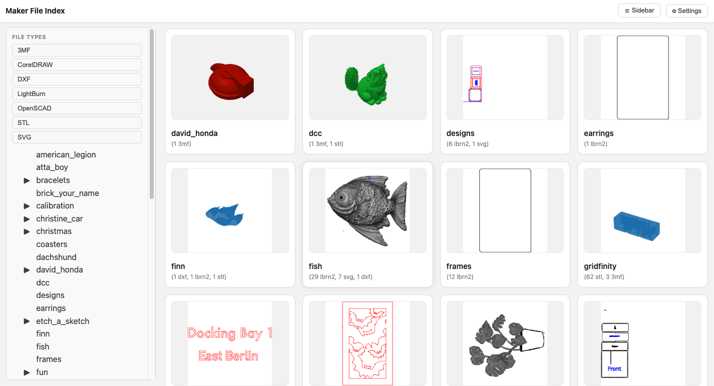
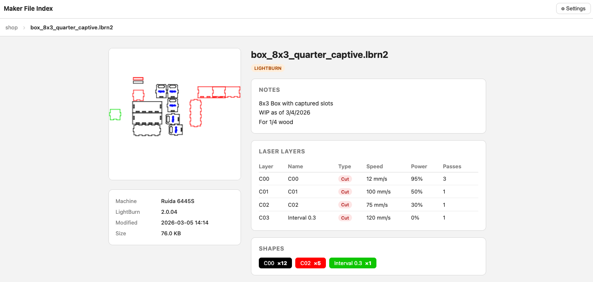

# maker-file-index

## File navigator for Maker files. Lightburn, STL, DXFs, etc.

Programmers have figured out that version control matters. They don't have files like 'project_final.doc', 'project_final_2.doc', 'project_final_really.doc.'

Version control, and project/file name management matter in other fields.

I can't speak for all 'Makers,' but I know that my code repositories tend
to be (reasonably) tidy, and my 3d printer, Laser Cutter, CNC Router, and other files
tend to not reflect the learnings that I made in my software.

This is a navigator for our design/machine control files. Run it and you can get an
index of all of the supported files, along with thumbnails and whatever metadata that
I can pull out about that file.



There is a list view, complete with the ability to choose dark mode, and to sort
on name or recent file access. You can hide or show the sidebar, and generally
navigate around your files in convenient ways.



If you drill down to a file you get a detail view with rich metadata, geometry stats,
and slicer/layer settings depending on the file type.

## Download

Pre-built executables (no Python required) are attached to each
[GitHub Release](../../releases). Download the binary for your platform
and run it directly:

| Platform | File |
|----------|------|
| macOS | `maker-file-index` |
| Windows | `maker-file-index.exe` |

On macOS you may need to allow the binary in **System Settings → Privacy & Security**
the first time you run it (Gatekeeper warning for unsigned binaries).

## Requirements

### Python install

- Python 3.12+
- `numpy-stl`, `matplotlib`, `ezdxf` (installed automatically)

### Optional: OpenSCAD thumbnails

Thumbnail generation for `.scad` files requires the **OpenSCAD** application
to be installed separately and available on your `PATH`.

- **macOS**: download from [openscad.org](https://openscad.org/downloads.html),
  or `brew install openscad`
- **Windows**: download the installer from [openscad.org](https://openscad.org/downloads.html)
  and ensure the install directory is added to `PATH`
- **Linux**: `sudo apt install openscad` or equivalent

If OpenSCAD is not installed, `.scad` files are still indexed and get a detail
page — only thumbnail generation is skipped. All other file types generate
thumbnails without any external tools.

## Quick start

```bash
pip install -e .
maker-file-index <path>
```

All output goes into a dedicated directory (default: `maker_file_data/`) — your source files are never modified.

```
maker_file_data/
  maker_file_notes.md   — Markdown report
  index.html            — landing page
  dirs/                 — per-directory HTML + Markdown pages and thumbnails
```

## Usage

```bash
maker-file-index TARGET [options]
```

## Arguments

### `TARGET`

File, directory, or glob to scan.

## Options

### `-o, --output-dir PATH`

Output directory for all generated files.
Default: `maker_file_data`

### `--alongside-source`

Write thumbnails alongside source files instead of in the output directory (opt-in, reverts to old behavior).

### `--no-recursive`

Do not scan subdirectories.

### `--relpath-root PATH`

Make file paths in the report relative to this directory.

### `--debug-plugins`

Show which plugin handles each file.

### `--version`

Print the version and exit.


## Features

- Plugin-based architecture — easy to extend with new file types
- **LightBurn** (`.lbrn2`, `.lbrn`) — embedded thumbnail and notes extraction
- **STL** — thumbnail generation via numpy-stl + matplotlib
- **OpenSCAD** (`.scad`) — thumbnail generation via OpenSCAD CLI
- **3MF** — embedded preview image extraction
- **SVG** — displayed directly as preview
- **DXF** — thumbnail generation via ezdxf + matplotlib
- **Corel Draw** (`.cdr`) — embedded thumbnail

### HTML output

- Landing page with all top-level directories, sorted newest first
- Per-directory pages with thumbnail grid
- Sidebar with full directory tree navigation, current page highlighted, scroll position preserved
- Clickable file type stat buttons on landing page (show count, filter on click)
- File type filter buttons in sidebar on directory pages
- Text search box to filter cards by name
- Breadcrumb navigation
- Colored file type badges on every card
- Notes snippet displayed on file cards
- Error badge on cards where thumbnail generation failed
- **LightBurn detail pages** — thumbnail, file metadata (machine, LightBurn version, material height, mirror), notes, laser layer table (color-coded, speed, power, passes, output, priority), shape counts, shapes per layer, embedded text strings, estimated cut time with per-layer vector/raster breakdown
- **STL detail pages** — dimensions (mm + inches), mesh stats (triangles, vertices, edges, connected components), manifold check, surface area and volume
- **3MF detail pages** — dimensions, mesh stats, manifold check, surface area and volume, package metadata (title, author, application), object/part names, slicer settings table (printer model, layer height, infill, supports, speeds — when present)
- **SVG detail pages** — SVG rendered directly as preview, document dimensions and viewBox, authoring tool detection (Inkscape, Illustrator, etc.), path count, open/closed paths, total estimated path length, element type breakdown, named layers/groups, text content
- **DXF detail pages** — thumbnail, AutoCAD version, dimensions, entity type breakdown, estimated path length by type, layer table (with ACI color swatches), entities-by-layer counts, text content
- **OpenSCAD detail pages** — thumbnail, file stats (lines, size), module definitions, parameter assignments, includes, primitive/transform/CSG counts, embedded comments and strings

## Utilities

### Installed CLI tools

```bash
lightburn-extract-notes <filename>   # Extract notes from a LightBurn file
lightburn-extract-text <filename>    # Extract text strings from a LightBurn file
```

### scripts/lightburn_extract.py

Extracts detailed information from a LightBurn file: metadata, notes, text strings, shape counts, cut settings, and estimated cut time with per-layer breakdown.

```bash
python scripts/lightburn_extract.py file.lbrn2
python scripts/lightburn_extract.py file.lbrn2 --json
```

| Option | Description |
|--------|-------------|
| `filename` | Path to `.lbrn2` or `.lbrn` file |
| `--json` | Emit structured JSON instead of a human-readable report |

### scripts/scad_extract.py

Extracts structure and metadata from an OpenSCAD file: module definitions, parameter assignments, includes/uses, primitive and CSG operation counts, custom module calls, comments, and embedded strings.

```bash
python scripts/scad_extract.py file.scad
python scripts/scad_extract.py file.scad --json
```

| Option | Description |
|--------|-------------|
| `filename` | Path to `.scad` file |
| `--json` | Emit structured JSON instead of plain text |

### scripts/stl_extract.py

Extracts geometry information from an STL file: format (binary/ASCII), header, triangle count, bounding box, dimensions, unique vertices/edges, connected components, manifold check, surface area, and volume.

```bash
python scripts/stl_extract.py model.stl
python scripts/stl_extract.py model.stl --json
```

| Option | Description |
|--------|-------------|
| `filename` | Path to `.stl` file |
| `--json` | Emit structured JSON instead of plain text |

### scripts/3mf_extract.py

Extracts geometry, package metadata, and slicer settings from a 3MF file. Supports standard 3MF and Bambu Lab project files.

```bash
python scripts/3mf_extract.py model.3mf
python scripts/3mf_extract.py model.3mf --json
```

| Option | Description |
|--------|-------------|
| `filename` | Path to `.3mf` file |
| `--json` | Emit structured JSON instead of plain text |

Reports: package metadata, unit, bounding box (raw and build-transformed), vertex/triangle counts, manifold check, surface area, volume, slicer settings (layer height, infill, supports, speeds, etc.), and object/part names.

### scripts/svg_extract.py

Extracts structure and geometry from an SVG file: dimensions, viewBox, element counts, named groups/layers, text content, path lengths, and open/closed path statistics.

```bash
python scripts/svg_extract.py file.svg
python scripts/svg_extract.py file.svg --json
```

| Option | Description |
|--------|-------------|
| `filename` | Path to `.svg` file |
| `--json` | Emit structured JSON instead of plain text |

Reports: root attributes, namespaces, element counts by tag, groups and Inkscape layer labels, text strings, overall bounding box, total estimated path length (bezier and arc curves approximated), and per-path details.

### scripts/dxf_extract.py

Extracts structure and geometry from a DXF file: header info, layer definitions, entity counts by type and layer, estimated path lengths, and text content.

```bash
python scripts/dxf_extract.py file.dxf
python scripts/dxf_extract.py file.dxf --json
```

| Option | Description |
|--------|-------------|
| `filename` | Path to `.dxf` file (ASCII format) |
| `--json` | Emit structured JSON instead of plain text |

Reports: AutoCAD version, sections present, layer table (name, color, linetype), entity counts, entities by layer, bounding box, estimated lengths for LINE/POLYLINE/CIRCLE/ARC/ELLIPSE, and all text content (TEXT, MTEXT, ATTRIB).

### scripts/extract_thumbnail.py

Standalone script for extracting and debugging thumbnails from LightBurn files.

```bash
python scripts/extract_thumbnail.py file.lbrn2
python scripts/extract_thumbnail.py file.lbrn2 -o thumb.png
python scripts/extract_thumbnail.py file.lbrn2 --debug
```

| Option | Description |
|--------|-------------|
| `file` | Path to `.lbrn2` or `.lbrn` file |
| `-o, --output PATH` | Output path (default: `<stem>_thumbnail.<ext>` next to input) |
| `--debug` | Show XML structure, where base64 data was found, decoded size, and detected image format |

The `--debug` flag is useful when a file has a `Thumbnail Source` in the XML but no image is being generated.

## Supported file types

| Type | Extensions | Thumbnail | Detail page |
|------|-----------|-----------|-------------|
| LightBurn | `.lbrn2`, `.lbrn` | Embedded in file | Yes |
| STL | `.stl` | Rendered via numpy-stl + matplotlib | Yes |
| 3MF | `.3mf` | Extracted from zip archive | Yes |
| SVG | `.svg` | Displayed directly | Yes |
| OpenSCAD | `.scad` | Rendered via OpenSCAD CLI *(requires OpenSCAD installed separately)* | Yes |
| DXF | `.dxf` | Rendered via ezdxf + matplotlib | Yes |
| Corel Draw | `.cdr` | Embedded in file | — |
